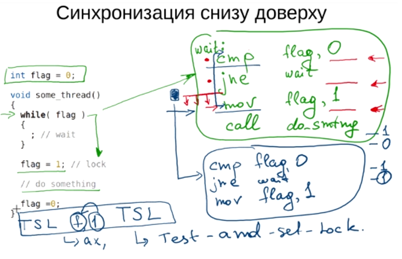
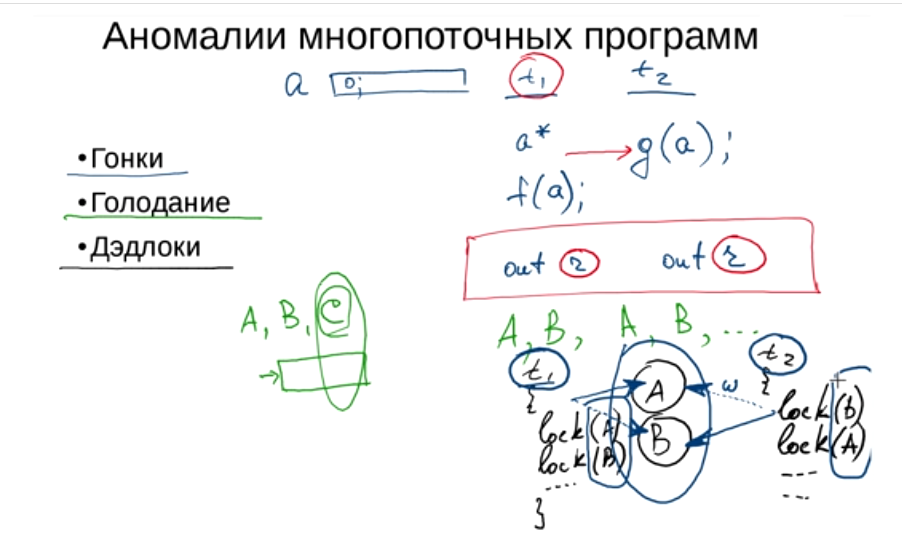
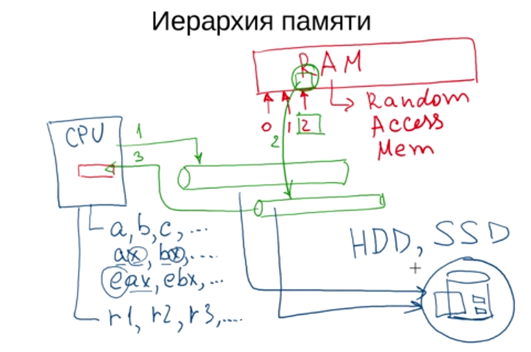
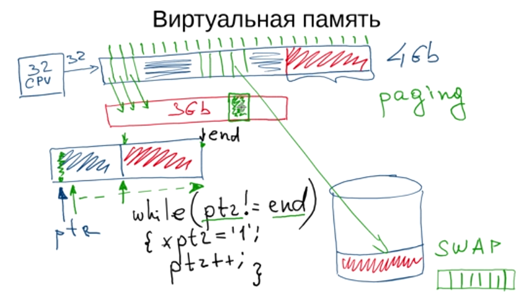
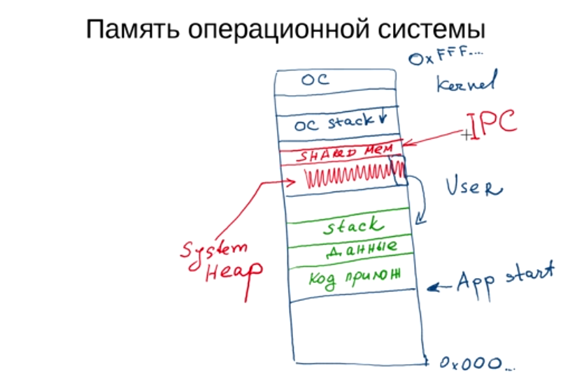
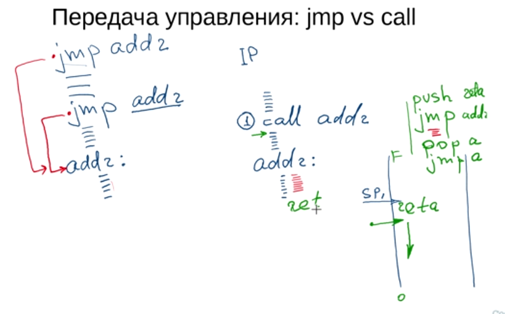
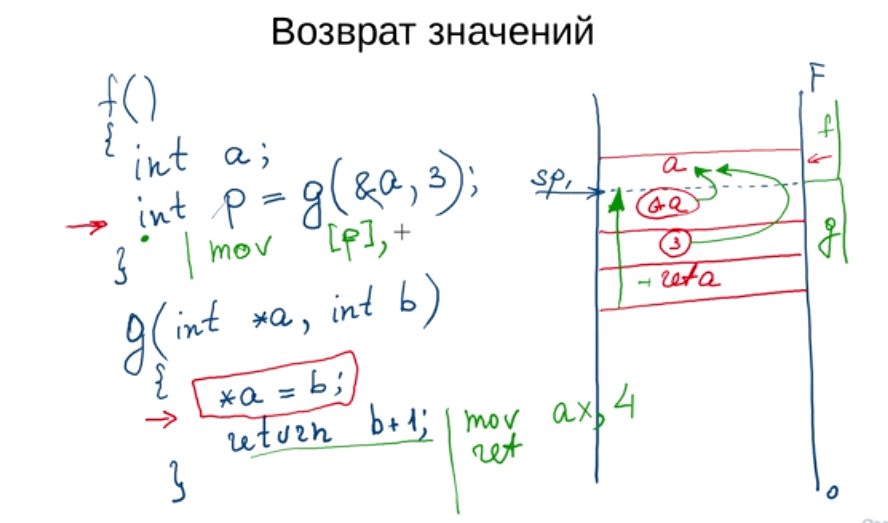
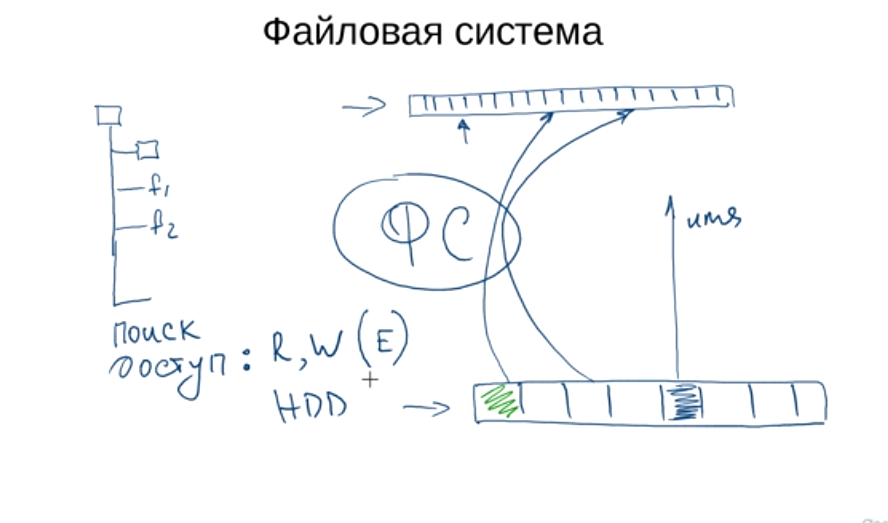
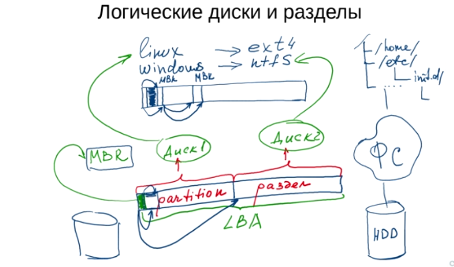

# Введение в архитектуру ЭВМ. Элементы операционных систем.

## 1. Введение принципы построения ЭВМ.

### Бинарные числа и логические операции

...

### Простейшие электронные компоненты

...

### Архитектура вычислительной системы

Современные вычислетельные системы построенны по принципам Фон-Неймана:

- **Адресность**. Все данные хранятся в ячейках памяти. Каждая ячейка имеет номер (или адрес). Процессор может прочитать или записать значение в ячейку используя её адрес.
- **Однородность памяти**. Память для команд и данных общая. То есть в любую ячейку можно записать как машинную инструкцию, так и какие-то данные. (В гарвардской арихитектуре память и данные хранятся отдельно).
- **Программное управление**. Управление вычислительным процессом осуществляется с помощью загруженной в память программы. Программа представляет из себя набор инструкций и данных, с которыми она работает. Для последовательного исполнения инструкций в системе существует специальная область памяти, которая содержит счетчик команд (IP, Instruction Pointer), который указывает на адрес текущей исполняемой инстукции.

Компоненты вычислительной системы:

- Арифметико-логическое устройство (ALU). Осуществляет арифметические и логические операции.
- Запоминающее устройство (память). Хранит данные и инстукции.
- Устройство ввода-вывода.
- Устройство управления.

Все устройства соединены между собой шинами (bus).

Все компоненты вычислительной системы обычно взаимодействуют друг с другом, а значит они должны быть синхронизированы. Для синхронизации используется тактовый генератор, который задает общее время в системе. Он генерирует импульсы, доступные всем элементам системы. В моменты импульсов какие-то элементы выполняют свои функции, какие-то просто меняют свое состояние.

Все операции по передаче или получению данных из внешних устройств называются операциями ввода-вывода. Существуют два варианта организации ввода-вывода:

- Через порты. Резервируется специальный диапазон адресов, которые называются портами. Можно считать, что номер порта - это логический номер устройства, через который процессор может общаться с этим устройством через шину памяти.
- Через память. Используется в случае, когда нет возможности использовать первый способ, то есть зарезервировать диапазон адресов под порты. В таком случае используется механизм, который позволяет отобразить диапазон адресов памяти внешнего устройства на диапазон адресов памяти вычислительной системы.

Важным механизмом при организации вычислений являются прерывания. Прерывание - это специальный сигнал процессору, который оповещает его о каком-то внешнем событии.

Когда происходит прерывание, процессор прекращает свою работу и обрабатывает прерывание. Происходит это так:
- на специальный контакт процессора подается сигнал, который сообщает о прерывании.
- процессор заканчивает исполнение текущей инструкции и переходит к обработчику прерывания - специальной программе, которая находится в памяти.
- после того, как обработка прерывания завершилась, процессор возвращется к выполнению прерванной программы.

Прерывания могут быть синхронными и асинхронными.
- Синхронные как правило происходят внутри самого процессора. Это могут быть исключительные ситуации (обращение к несуществующей ячейке памяти) или программные прерывания (например при выводе информации на экран).
- Асинхронные - те, которые приходят с внешних устройств. Например, сетевая плата может сгенерировать прерывание при необходимости записать данные из внутренней памяти в память вычислительного устройства.

Для того, чтобы упорядочить возникающие в системы асинхронные прерывания, используется специальное устройство, которое называется контроллером прерываний.

## 2. Введение в язык ассемблера

- Архитектура - набор регистров в команд.
- Команды могут быть 3х типов.
    - вычислительные (арифметические, логические)
    - работа с памятью (запись из памяти в регистр, запись из регистра в регистр)
    - команды управления (условные и безусловные переходы)

Пример программы на ассемблере (возведение числа в степень):

```
power:
    push %ebx

    mov $1, %ebx
    test %edx, %edx
    jz end

    mov $0, %ebx
    test %eax, %eax
    jz end
    
    mov $1, %ebx
loop:
    imul %eax, %ebx
    dec %edx
    test %edx, %edx
    jz end
    jmp loop
end:
    mov %ebx, %eax
    pop %ebx
    ret
```

## 3. Базовые элементы операционной системы

### Задачи операционной системы

Назначение ОС:
- управление аппаратными ресурсами (процессор, память, устройства ввода-вывода).
- абстракция оборудования и унификация доступа
- предоставление расширенных возможностей по управлению процессором и периферией
- защита, разделение доступа

Базовые компоненты ОС:
- планировщик
- менеджер памяти
- механизмы межпроцессного взаимодействия

Адресное пространство - диапазон адресов (имен), которые могут быть использованы для адресации данных.

Процесс - это программа, исполняемая процессором и связанные с данной программой ресурсы (адресное пространство, файлы, регистры).

Файл - это именованая последовательность данных на каком-либо носителе. Можно также определить файл как универсальный интерфейс доступа к данным и к устройствам. В файл можно писать данные, также можно читать данные из файла. Файл имеет следующие атрибуты:
- Имя
- Флаги доступа
- Тип
- Указатель на текущий символ
- ...

### Планировщик, менеджер памяти, IPC

Планировщик - позволяет переключать исполнение с одного процесса на другой. Обеспечивает многозадачность.

Менеджер памяти - определяет, каким образом устроено адресное пространство, каким образом это адресное пространство отображается на физическую память. Менеджер памяти так же занимается разделением и защитой адресных пространств разных процессов, а так же выполняет запросы на дополнительное выделение памяти для них.

IPC (Inter Process Communications, межпроцессное взаимодействие) - различные механизмы, которые обеспечивают взаимодействие между процессами.

Операционную систему можно представлять как набор различных программных компонентов, расположенных "между" приложениями и аппаратными устройствами (hardware):

***********
**Приложения**
***********
**OS**
***********
**Hardware**
***********

Запущенные экземпляры приложений мы называем процессами.

#### Режим ядра и режим пользователя

Многие современные процессоры поддерживают так называемый защищенный режим. То есть процессы могут запускаться в таком окружении, в котором они не могут использовать ресурсы других приложений и влиять на работу OS.

С каждым процессом связан дескриптор, который в том числе хранит специальный флаг, указывающий на уровень доступа для кода, связанного с этим процессом (дескриптор процесса также хранит адреса инстукций (код), которые исполняются в рамках данного процесса). Значение данного флага может быть 00, 01, 10, 11. 00 - можно исполнять все инструкции (kernel space, остальные - user space).

### Системные вызовы и обработка прерываний

Типы прерываний:

- Прерывания, обеспечивающие ввод-вывод
- Прерывания таймера
- Исключения
- Системные вызовы

Системный вызов - это обращение прикладной программы к сервису ОС. Примеры системных вызовов:

- open/close. Открытие/закрытие файла/устройства.
- read/write.
- fork/clone. Позволяют создавать новые процессы.
- ioctl. Универсальный системный вызов, позволяет передавать различные параметры устройствам или задавать параметры каким-то системным объектам (например файлам).

Драйвер - это модуль ОС, позволяющий получать доступ к реальному или виртуальному устройству. Устройства как правило делятся на 3 класса:

- символьные
- блочные
- сокеты

### Процессы, потоки, многозадачность

Процесс - это программа + связанные с ней ресурсы. Поток - это последовательность команд внутри процесса.

Базовый цикл потока:

- Active. Поток исполняется в текущий момент времени.
- Wait. Поток находится в состоянии ожидания, процессор не исполяется никакие инструкции, связанные с этим потоком. Пример - ожидание завершения ввода-вывода.
- Ready. Поток может продолжить исполняться, но процессор может быть занят другим потоком.

Многозадачность:

- Вытесняющая.
- Невытесняющая.

Синхронизация потоков.

Критическая секция - фрагмент кода, внутри которого осуществляется доступ к общему (разделяемому) ресурсу в памяти.

Чтобы обеспечить корректный доступ к такой секции, необходимо, чтобы выполнялись следующие требования:

- в критической секции не более одного процесса.
- если процесс находится вне КС, то он не должен блокировать другие процессы
- независимость процессов (не должно быть предположений об общем количестве процессов в системе)
- отсутствие ситуаций бесконечного ожидания





### Организация памяти

#### Классификация видов памяти



#### Арифметика указателей



#### Память процесса







#### ABI (Application Binary Interface)

[https://stepik.org/lesson/13493/step/15?unit=3649](https://stepik.org/lesson/13493/step/15?unit=3649)

### Устройство дисковых накопителей

[https://stepik.org/lesson/13494/step/1?unit=3650 (HDD)](https://stepik.org/lesson/13494/step/1?unit=3650)

[https://kinsta.com/blog/what-is-ssd/](https://kinsta.com/blog/what-is-ssd/)

### Файловые системы





## Межпроцессное взаимодействие

### Механизмы

- Файл
- Pipes (named and anonymous)
- Signals
- Shared memory
- Socket

### Принципы организации IP сетей

Модель OSI, Стек протоколов TCP/IP. IPv4, маска подсети.